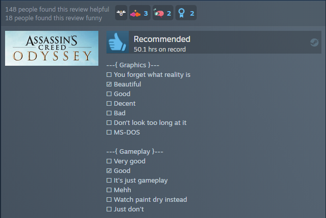

#### Hosted with ❤ by Github over here: [https://vojtastruhar.github.io/steam-review-template/](https://vojtastruhar.github.io/steam-review-template/)

# Steam Review Template

This is a tool to simplify the creation of copy-pasta reviews that are somewhat popular on Steam. The categories and options are not from my head, I just copied them from somewhere. There are some minor variations on some of the options, but this is the typical rundown.



## Usage

You just tick all the boxes that you want, the output should look something like this:

```
---{ PC Requirements }---
☐ Check if you can run paint
☐ Potato
☐ Decent
☐ Fast
☑ Rich boi
☐ Ask NASA if they have a spare computer
```

It will generate with a line on the bottom that gives me credit. I would appreciate it if you left it there, but you don't have to :)

## Adding more languages

It's heartwarming to see contributors adding their own languages! To make it a little easier, here's rouhly how:

1. Add your language code to the `locales` array in Astro config.
2. Add new template translation to in `src/review_templates` and export it in `src/review_templates/general.js`.
3. Add new `index.astro` translation to a folder with your language code.
4. Add your flag emoji to the `FlagSelect.astro` component.

You are officially awesome! ✅
